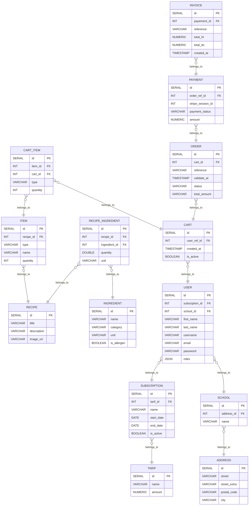

```mermaid
erDiagram
    TARIF {
      SERIAL id PK
      VARCHAR name
      NUMERIC amount
    }
    SUBSCRIPTION {
      SERIAL id PK
      INT tarif_id FK
      VARCHAR name
      DATE start_date
      DATE end_date
      BOOLEAN is_active
    }
    SUBSCRIPTION }o--|| TARIF : belongs_to

    RECIPE {
      SERIAL id PK
      VARCHAR title
      VARCHAR description
      VARCHAR image_url
    }
    ITEM {
      SERIAL id PK
      INT recipe_id FK
      VARCHAR type
      VARCHAR name
      INT quantity
    }
    ITEM }o--|| RECIPE : belongs_to

    RECIPE_INGREDIENT {
      SERIAL id PK
      INT recipe_id FK
      INT ingredient_id FK
      DOUBLE quantity
      VARCHAR unit
    }
    RECIPE_INGREDIENT }o--|| RECIPE : belongs_to
    RECIPE_INGREDIENT }o--|| INGREDIENT : belongs_to

    INGREDIENT {
      SERIAL id PK
      VARCHAR name
      VARCHAR category
      VARCHAR unit
      BOOLEAN is_allergen
    }

    ADDRESS {
      SERIAL id PK
      VARCHAR street
      VARCHAR street_extra
      VARCHAR postal_code
      VARCHAR city
    }
    SCHOOL {
      SERIAL id PK
      INT address_id FK
      VARCHAR name
    }
    SCHOOL }o--|| ADDRESS : belongs_to

    "USER" {
      SERIAL id PK
      INT subsciption_id FK
      INT school_id FK
      VARCHAR first_name
      VARCHAR last_name
      VARCHAR username
      VARCHAR email
      VARCHAR password
      JSON roles
    }
    "USER" }o--|| SUBSCRIPTION : belongs_to
    "USER" }o--|| SCHOOL : belongs_to

    CART {
      SERIAL id PK
      INT user_ref_id FK
      TIMESTAMP created_at
      BOOLEAN is_active
    }
    CART }o--|| "USER" : belongs_to

    CART_ITEM {
      SERIAL id PK
      INT item_id FK
      INT cart_id FK
      VARCHAR type
      INT quantity
    }
    CART_ITEM }o--|| CART : belongs_to
    CART_ITEM }o--|| ITEM : belongs_to

    "ORDER" {
      SERIAL id PK
      INT cart_id FK
      VARCHAR reference
      TIMESTAMP validate_at
      VARCHAR status
      VARCHAR total_amount
    }
    "ORDER" }o--|| CART : belongs_to

    PAYMENT {
      SERIAL id PK
      INT order_ref_id FK
      INT stripe_session_id
      VARCHAR payment_status
      NUMERIC amount
    }
    PAYMENT }o--|| "ORDER" : belongs_to

    INVOICE {
      SERIAL id PK
      INT payement_id FK
      VARCHAR reference
      NUMERIC total_ht
      NUMERIC total_ttc
      TIMESTAMP created_at
    }
    INVOICE }o--|| PAYMENT : belongs_to
```